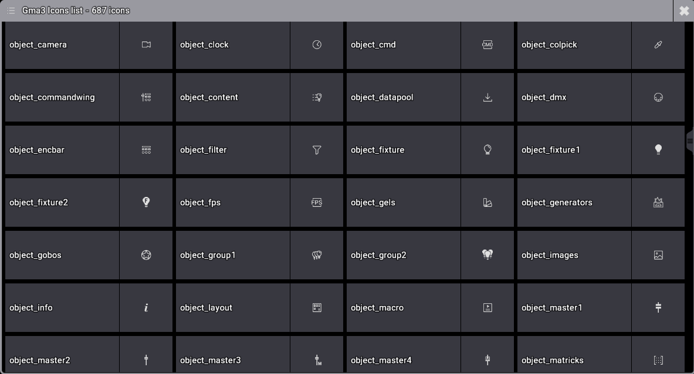

# Gma 3 Icon List

This is a GrandMa 3 plugin that show all icons available by default.

The list is generated with the graphics.textures.xml file.

You can click on the icon to copy the name and use it in your plugins.

This is an open source project, feel free to contribute by making pull requests.
